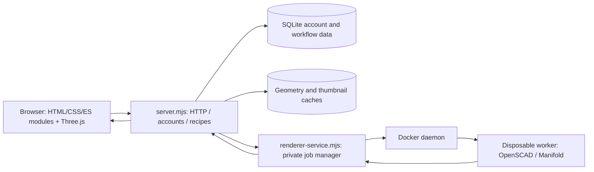

# Architecture and dependencies

[Documentation home](README.md)

## Runtime components

Authenticated HTML pages use negotiated gzip compression with private, uncached responses; decoded markup is unchanged. Editor record refreshes preserve object identity and reuse each copy’s own configuration instead of cloning every parameter on every read. Copy configurations remain separate from one another and from their source.

The browser uses plain JavaScript modules, HTML and CSS; there is no React/Vue framework or frontend bundler. `public/app.js` coordinates the main editor. Smaller modules handle packing, export geometry, settings, history and color analysis. Web workers move suitable export work off the UI thread.

`server.mjs` uses Node HTTP and built-in SQLite, and owns authentication, account-scoped persistence, validation, metadata, render orchestration and HTTP routing. `renderer-service.mjs` is the private trusted manager. `renderer-worker.mjs` dispatches one runtime operation inside a disposable container. The worker does not receive the account database or Docker socket. See [Security](../SECURITY.md) for detailed limits and recovery.

## What it uses

| Dependency | Role / source |
| --- | --- |
| Node.js 22.5+ | ES modules, HTTP, filesystem, crypto, subprocesses and `node:sqlite`; [package manifest](../package.json) |
| OpenSCAD with Manifold support | Compiles/evaluates SCAD and produces geometry; worker image in [Dockerfile](../Dockerfile) |
| Docker / Buildx | Builds the runtime and isolates each render; Colima or Docker Desktop supplies the macOS daemon |
| Three.js | Browser visualization and shared geometry/matrix operations; vendored under `public/vendor/three` |
| fflate | ZIP/3MF packing and unpacking; vendored with the Three.js addon libraries |
| @xmldom/xmldom | Server-side XML parsing for 3MF |
| Resend / Nodemailer | Verification email via Resend or SMTP; no AI service involved |
| Fontconfig / Baloo font files | Font discovery and repeatable SCAD text rendering |
| ImageMagick / Xvfb | Worker thumbnail/image operations and headless rendering support |
| Local Bambu profiles | Optional machine/process templates, loaded separately; no printer-cloud connection |
| Caddy or Cloudflare Tunnel | Optional deployment ingress; renderer remains private |

Exact npm resolutions are in `package-lock.json`. Docker base tags can move: production should pin reviewed digests when reproducibility requires it. Host OpenSCAD is a development/test option; dependency-bearing uploads require isolated execution.

## Main flows

1. **Load and preview:** the browser requests workspace/model metadata. `modelInfoFromSource` combines the syntax scanner, literal parameter reader, font defaults and object selectors. Validated values become OpenSCAD definitions. `renderModel` schedules a local/trusted or remote render, then the browser loads the geometry. Preview mode can cap large literal `$fn` values; full export does not apply that preview reduction.
2. **Arrange:** `originLayout` checks newly imported objects when Auto Position is enabled; `arrangeObjects` packs their bounds against the selected printer. The editor keeps transforms and plate identities separate from SCAD source.
3. **Export:** selected geometry requests and settings become a recipe. The server validates/finalizes it, renders unique requests, transforms closed solids, assigns colors, places objects on the bed and packs 3MF. Estimates and a raster preview use that same final geometry. A successful record retains the recipe and fingerprint, then returns generated bytes.
4. **Replay:** load an owner-scoped immutable snapshot, check renderer compatibility, regenerate, compare uncompressed archive content and return it only when checks pass. Reusing the preview requires matching the recipe, not merely an unchanged project thumbnail.
5. **Instant:** quarantine a package, parse orders and mapping, freeze a run snapshot, enqueue work, render unique designs, group/pack plates and route the download through recorded export. Cancellation propagates to active work; restart recovery handles interrupted operations.

## Color and concurrency invariants

`renderSolidParts` renders selected parts separately so each remains a closed mesh with preserved colors. Per-part renders pass through the app's global scheduler. Do not replace this with a lazy-union batch solely to reduce subprocess count: affected OpenSCAD versions flatten color indices. The 3MF packer emits palette and part/extruder metadata; triangle paint is needed only where the geometry representation requires it.

`parallelWork` bounds independent tasks, preserves result order and waits for cancellation before callers dispose geometry. The app's weighted `RenderScheduler` and manager worker limits bound total work. `SharedRenders` shares in-flight requests; render caches avoid repeated identical geometry. External source dependencies bypass unsafe source-only result reuse. Cache identity and export snapshot identity are distinct.

The local launcher derives new/stopped VM resources from host capacity and worker slots from the Docker daemon's real memory/CPU budget. Explicit worker limits remain available. Capabilities are built into the worker image and smoke-tested at manager startup. Performance varies with SCAD boolean complexity, distinct inputs, fonts, memory and container startup; repeated copies are cheaper than distinct designs.

## Persistence and ownership

| Location | Contents / lifetime |
| --- | --- |
| `data/` (or `PMM_DATA_DIR`) | SQLite users, hashed sessions/challenges, workspaces/revisions, profiles, production records, Instant snapshots and export history |
| `data/geometry` in the default layout | Runtime geometry cache payloads; not the final history download archive |
| `cache/` | Local service PID/log and font/runtime working caches; generated operational state |
| `models/`, `profiles/`, `fonts/` | Project assets; bundled versus personal files have different release rules |
| `bambu-profiles/BBL` | Locally supplied vendor presets |
| `secrets/`, local `.env` files | Operator credentials; excluded from release packaging |
| Per-render `/job` and `/tmp` | Temporary worker input/output; removed with the container |

Export snapshot rows store recipe JSON, preview, summary, hash and fingerprint; history events reference snapshots. Final 3MF bytes are generated on demand. Workspaces, revisions, Instant snapshots and export history have different lifetimes: deleting a workspace does not mutate a previously recorded export recipe. Account deletion and explicit history deletion are separate destructive operations.

Server schemas and migrations are in `server.mjs`; Instant, variant and export-history stores initialize their additional tables. Ownership checks belong on the server, regardless of browser filtering. Back up durable data before schema work; do not treat `data/` as disposable test output.
